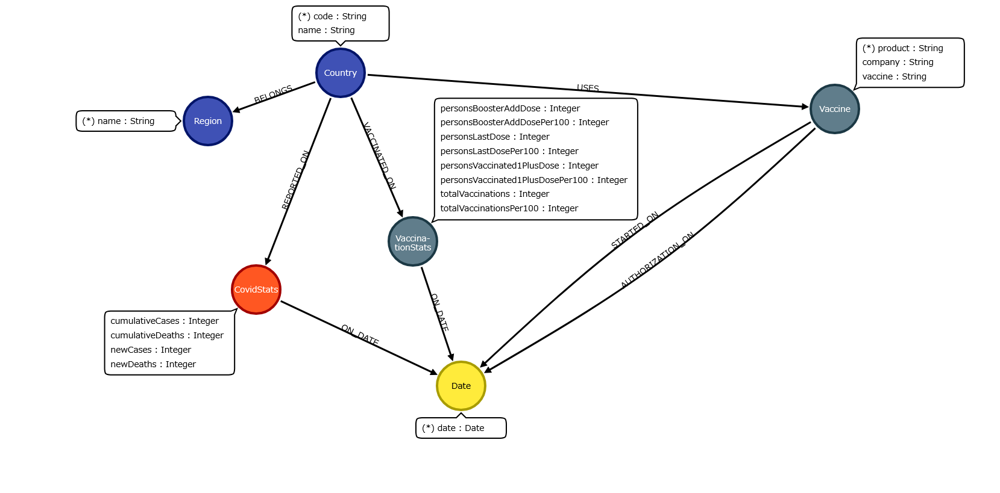

# desafiogolang-neo4j
Este repositório é um desafio de programação que contém os seguintes requisitos:

Ler uma base de dados da plataforma [Kaggle](https://www.kaggle.com/datasets/abdoomoh/daily-covid-19-data-2020-2024?resource=download) e armazená-los em um banco de dados de grafo Neo4j.

Criar uma API para ler os dados no banco de dados e responder algumas perguntas específicas:

1. Qual foi o total acumulado de casos e mortes de Covid-19 em um país específico em uma data determinada?
2. Quantas pessoas foram vacinadas com pelo menos uma dose em um determinado país em uma data específica?
3. Quais foram as vacinas usadas em um determinado país e em que data elas começaram a ser aplicadas?
4. Qual país registrou o maior número de casos acumulados até uma data específica?
5. Qual foi a vacina mais utilizada em uma região específica?

## Tabela de Conteúdos
- [Modelo dos dados](#modelo-dos-dados)
- [Quickstart](#quickstart)
- [Carregando os dados](#carregando-os-dados)
- [Endpoints](#endpoints)
- [Estrutura e Testes](#estrutura-e-testes)
- [Considerações finais](#considerações-finais)
- [Author](#author)
- [License](#license)

## Modelo dos dados
A imagem abaixo representa o modelo dos dados para serem armazenados no banco de dados com seus respectivos requisitos de correlação.

<a id="image1"></a>


## Quickstart
A maneira mais simples de rodar a aplicação é por meio de Docker, não é necessário mexer em nenhuma configuração dos arquivos, segue os passos rápidos para execução:

```bash
git clone https://github.com/Geronaso/desafiogolang-neo4j.git
docker-compose up -d --build

```

Após alguns minutos necessário a aplicação estara disponível na porta 8080, para consulta dos dados.

A seguir explicarei com detalhes o funcionamento e abordagem utilizada na solução.

Caso esteja com o seguinte erro:

```
covid19-api | exec ./scripts/start.sh: no such file or directory covid19-api exited with code 1
```

Certifique-se de que o arquivo /scripts/start.sh esteja com formatação LF para rodar no container linux.


## Carregando os dados

Após subir a aplicação, existem dois scripts na pasta /scripts/


## start.sh

Esse script é executado sempre que o container da aplicação covid19-api é colocado no ar.

Esse script ele checa a varíavel de ambiente:

```
LOAD_DATA = "true"
```

Se caso ela for true ele executa o load_data.go, carregando assim os dados no banco de dados. Você pode acompanhar na tela de log do próprio container a leitura e carregamento dos dados, é só omitir o flag -d na hora de subir a aplicação.

É recomendado que após feito o carregamento inicial de dados no banco de dados, mude essa varíavel no arquivo docker-compose.yml para "false". Assim quando subir novamente a aplicação os dados não sejam carregados novamente.

## load_data.go

Esse script é um script feito para ler os dados localizados na pasta /data/ em formato de arquivos .csv.

Ele lê linha a linha os arquivos e carrega eles no banco de dados, seguindo a modelagem descrita na [figura 1](#image1).

Após terminar a sua execução o main.go é executado, subindo assim a API.


# Endpoints

A documentação dos endpoints pode ser encontrada aqui:

https://geronaso.github.io/desafiogolang-neo4j/

Ou então no arquivo openapi.yaml caso prefira.

## Requisições
Para facilitar, o arquivo requests.http possui alguns exemplos de requisições prontas para serem executadas.


# Estrutura e Testes
A estrutura do código é bem simples, existe o main.go que é o ponto inicial do código e fornece a API. E dentro da pasta /handlers estão os códigos relacionados a cada endpoint e um arquivo com os testes.


Os testes fazem uso de um container de banco de dados exclusivamente para testes, que está localizado no docker-compose.yml, o neo4j_test.
Para execução dos testes você pode executar eles de dentro do container da aplicação. Com o container em execução:

```
docker exec -it covid19-api sh
go test -v ./handlers
go test -cover ./handlers
```

Deve retornar um coverage de ~75% (nas considerações finais está comentado pq não está cobrindo 100%)


Os testes estão todos localizados em um arquivo por questão de simplicidade, eles funcionam da seguinte forma:

Dados são criados no banco de dados para testes.

Algumas requisições são simulados e enviadas para API, o acesso ao banco de dados é feito e as respostas são testadas.

Por fim os dados criados são excluidos do banco de dados de teste.


# Considerações finais

Nessa parte vou relatar melhorias do código e algumas considerações.

Os testes não estão cobrindo 100% das funções, pois faltou escrever testes para algumas situações de erro encontrado em alguns endpoints. No  entanto o arquivo highest_cases.go está cobrindo todos os casos. Seria necessário replicar os testes para os outros endpoints para ter uma cobertura completa.

O arquivo WHO-COVID-19-global-table-data.csv de dados não foi utilizado por não possuir um campo de data e a relação de aresta estabelecida (REPORTED_ON) já é tratada no arquivo WHO-COVID-19-global-data.csv. O que me pareceu redundante para as perguntas feitas no desafio, portanto não foi carregado.

Foi removido uma linha do arquivo vaccination-data.csv devido a sua inconsistencia de dados (por contar um ; a mais), o valor em questão:
occupied Palestinian territory; including east Jerusalem;PSE;EMRO;REPORTING;18/10/2022;3748571;2012767;73;39;1776973;35;;02/02/2021;;336967;7

Idealmente uma melhoria seria na hora de tratar os dados, por usar fontes de dados diferentes, existe uma certa inconsistencia, e.g.:

O arquivo vaccination-data utiliza uma abreviatura de 2 letras para o código do país, enquanto o arquivo WHO-COVID-19-global-data utiliza uma abreviatura de 3 letras. Gerando nós diferentes na hora de sua criação.

Portanto tratar melhor os dados ajudaria a ter uma precisão maior.

Por fim, a questão de performance:

1. Foram criados constraints para fazer otimização na consulta de dados no arquivo load_data.go
2. Para um ambiente de produção que teria uma quantidade de dados muito maior, considerar a implementação de um redis para armazenar resultados de consultas frequentes.
3. Carregar os dados de maneira eficiente, como não era o foco do trabalho não foi elaborado. Mas talvez a utilização de goroutines de maneira assincrona possa ser estudado melhor.
4. Utilização de clusters de Neo4j
5. Logs, não foi implementado mas é uma pratica necessário para um ambiente de produção
6. Load balancer ou Kubernetes, no caso de multiplos nós estudar a implementação dessas soluções.


De considerações e melhorias que consigo pensar agora acredito que sejam essas.
Qualquer dúvida, critica ou sugestão fico a disposição.


## Author
Cézar Murilo (cezarmgt@gmail.com)

## License

GNU General Public License v3.0 or later.

See [LICENSE](LICENSE) for the full text.
